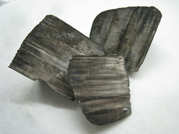
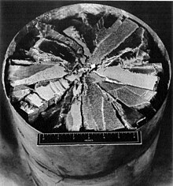
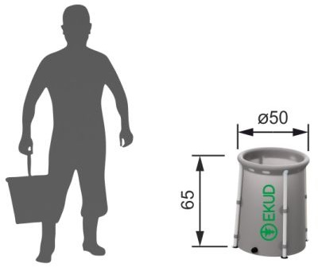

# Polonium RTG: *Re*math*ter*

**Disclaimer**: This is an update to a question [here](https://worldbuilding.stackexchange.com/questions/263239/reality-check-energy-source-for-power-armour). I hit the character limit, but still wanted to redo some calculations as I spotted mistakes which were too late to edit in place.

## Scaling

It was a surprise for me to learn that MMRTG operates not on pure plutonium, but on its oxide. Unsurprisingly, oxide has a different density from pure metal. This affects the power-to-volume scaling constant. Data on plutonium oxide is taken from [here](https://mars.nasa.gov/internal_resources/788/).

$$
W\_{\text{PuO}\_2}^{\text{thermal}} = \frac{2\ kW}{4.8\ kg} = 0.417 \frac{kW}{kg}
$$

$$
\text{scale$\_\text{ Po}$} = \frac{W\_{\text{PuO}\_2}^{\text{thermal}} \cdot \rho\_{\text{Po}}}{W\_{\text{Po}}^{\text{thermal}} \cdot \rho\_{\text{PuO}\_2}} = \frac{140 \cdot \frac{kW}{kg} 11.5 \frac{kg}{L}}{0.417 \frac{kW}{kg} \cdot 9.2 \frac{kg}{L}} = 419.7
$$

Moreover, the actual boiling point of polonium is $962 °C$, which is lower than the boiling point of lithium. To enable lithium as a coolant, one must substitute pure polonium with thulium polonide, $\text{PoTm}$, which has  [*melting point*](https://en.wikipedia.org/wiki/Polonide#Intermetallic_polonides) of $2200 °C$. No salting is needed, which is likely not that trivial anyway. With so much heat power polonium could be replaced by its compound with no problems.

This affects the scale factor and in order to compute it I need a density of $\text{PoTm}$, which is, apparently, an unobtainable value. I will estimate it by polonium density as thulium and polonium have surprisingly similar values. The thermal power should be less and, the precise output is nowhere to be found. I will approximate it by molar mass ratio. 

$$
\text{scale$\_\text{ PoTm}$} = \frac{\mu\_{Po}}{\mu\_{PoTm}} \cdot \text{scale$\_\text{ Po}$} = \frac{210}{210 + 168} \cdot 419.7 = 233.2
$$

## Coolant

There is a better cooling material than pure lithium and while we are at it, let's consider a bit more nuanced approach for energy loss calculation. 

First, let's do water and lithium again.

### Lithium

Reactive metal that is easily melted and needs to be sheltered from water and the atmosphere.

There are different stages the mole of lithium goes through before escaping into the environment and each step eats a bit of energy, not only evaporation.

$$
^7\text{Li}^{\text{20°C}} \overset{\text{heating}}{\longrightarrow} \ ^7\text{Li}^{\text{180.5°C}} \overset{\text{melting}}{\longrightarrow} \ ^7\text{Li}^{\text{180.5°C}} \overset{\text{heating}}{\longrightarrow} \ ^7\text{Li}^{\text{1330°C}} \overset{\text{evaporating}}{\longrightarrow} \ ^7\text{Li}^{\text{1330°C}}\overset{\text{escape}}{\longrightarrow}
$$

Energies for all these processes are as follows.

$$
E\_{\text{heat capacity}} = 24.86 \frac{J}{\text{mol} \cdot K}
$$
$$
E\_{\text{fusion}} = 3 \frac{kJ}{\text{mol}}
$$

$$
E\_{\text{evaporation}} = 136 \frac{kJ}{\text{mol}}
$$

Putting it all together.

$$
E^{^7\text{Li}}\_{\text{specific}} = \frac{3 + 136 + 24.86 \cdot 10^{-3} \cdot (1330 - 20)}{7} = \frac{171.57}{7} = 24.5 \frac{kJ}{g}
$$

However, we can do better. Lithium has another stable isotope which weighs less.

$$
E^{^6\text{Li}}\_{\text{specific}} = \frac{171.57}{6} = 28.6 \frac{kJ}{g}
$$

With that to dissipate one thermal kilowatt of power during the whole day, the following amount of lithium is needed.

$$
m^{^6Li}\_{\text{loss}} = \frac{3600 \cdot 24 \text{ sec} \cdot 1 \frac{kJ}{s}}{28.6 \frac{kJ}{g} \cdot 1 \text{ day} \cdot 1 \text{ kW}} = 3 \ \frac{\text{kg}}{\text{day} \cdot \text{kW}}
$$

### Water

Some pressure could be applied to make the whole process a bit more effective.

 Modern firefighters use pressure up to $37 kPa$. With this pressure, the boiling temperature is around $250°C$.

$$
\text{H$\_2$O}^{\text{20°C}} \overset{\text{heating}}{\longrightarrow} \text{H$\_2$O}^{\text{250°C}} \overset{\text{evaporating}}{\longrightarrow} \text{H$\_2$O}^{\text{250°C}} \overset{\text{escape}}{\longrightarrow}
$$

$$
E\_{\text{heat capacity}} = 75.385  \frac{J}{\text{mol} \cdot K}
$$

$$
E\_{\text{evaporation}} = 40.66 \frac{kJ}{\text{mol}}
$$

Together the energy is as follows.

$$
E^{\text{H$\_2$O}}\_{\text{specific}} = \frac{40.66 + 75.385 \cdot 10^{-3} \cdot 230}{18} = 3.2 \frac{kJ}{g}
$$

Thus, the mass loss.

$$
m^{\text{H$\_2$O}}\_{\text{loss}} = \frac{3600 \cdot 24 \text{ sec} \cdot 1 \frac{kJ}{s}}{3.2 \frac{kJ}{g} \cdot 1 \text{day} 1 \cdot 1 \text{ kW}} = 26.8 \ \frac{\text{kg}}{\text{day} \cdot \text{kW}}
$$

Almost ten times worse than lithium, but the temperature of the cold sink is lower and that permits higher maximum efficiency and compactness. This temperature could support pure polonium instead of thulium polonide.

### Lithium hydride

This is a lithium compound, $\text{LiH}$, that decomposes into lithium and hydrogen near 1000°C. 

Here is a black-and-white image of it for reference.

The key factor here is that it has greater density than lithium and significant formation energy. 

$$
E^{\text{LiH}}\_{\text{formation}} = 90 \frac{kJ}{\text{mol}}
$$

The price for it is increased molar mass by a single nuclei. The $\text{stage I}$ of the heating process goes as follows.

$$
^6\text{LiH}^{\text{20°C}} \overset{\text{heating}}{\longrightarrow} \ 
^6\text{LiH}^{\text{688.7°C}} \overset{\text{melting}}{\longrightarrow} \ 
^6\text{LiH}^{\text{688.7°C}} \overset{\text{heating}}{\longrightarrow} \
^6\text{LiH}^{\text{1000°C}} \underset{\text{boiling}}{\overset{\text{decomposition}}{\longrightarrow}} \ ^6\text{Li}^{\text{1000°C}} + \frac{1}{2}\text{H}\_2^{\text{1000°C}}
$$

The important thing here is to account for escaping hydrogen, $\text{stage II}$ goes similar to pure lithium described above.

$$
^6\text{Li}^{\text{1000°C}}  \overset{\text{heating}}{\longrightarrow} \ ^6\text{Li}^{\text{1330°C}} \overset{\text{evaporation}}{\longrightarrow} \ ^6\text{Li}^{\text{1330°C}} \overset{\text{escape}}{\longrightarrow}
$$

There are many important energy values to consider. Enthalpy of fusion for $\text{LiH}$ is found on [pubchem](https://pubchem.ncbi.nlm.nih.gov/compound/62714#section=Other-Experimental-Properties), the rest are on the respected wiki pages for [hydrogen](https://en.wikipedia.org/wiki/Hydrogen), [lithium](https://en.wikipedia.org/wiki/Lithium) and [lithium hydrate](https://en.wikipedia.org/wiki/Lithium_hydride). 

$$
E\_{\text{fusion}}^{\text{LiH}} = 22.59 \frac{kJ}{\text{mol}}
$$
$$
E\_{\text{decomposition}}^{\text{LiH}} = E^{\text{LiH}}\_{\text{formation}} = 90 \frac{kJ}{\text{mol}}
$$
$$
E\_{\text{heat capacity}}^{\text{H}\_2} = 28.836  \frac{J}{\text{mol} \cdot K}
$$
$$
E\_{\text{evaporation}}^{\text{Li}} = 136 \frac{kJ}{\text{mol}}
$$
$$
E\_{\text{heat capacity}}^{\text{Li}} = 75.385  \frac{J}{\text{mol} \cdot K}
$$

All this together goes as follows, provided $^6\text{Li}$ is used.

$$
E\_{\text{specific}}^{\text{LiH}} = \frac{22.59 + 90 + \frac{1}{2}28.836\cdot 0.98 }{6 + 1} + \frac{136 + 75.385 \cdot 1.31}{6 + 1} = 
$$
$$
= \frac{126.72}{7}\_{1000°C}^{\text{stage I}} + \frac{234.75}{7}\_{1330°C}^{\text{stage II}} = \frac{361.47}{7} = 
$$
$$
51.64 \frac{kJ}{g}
$$

For the whole day, to dissipate a single thermal kilowatt one needs the following amount of lithium hydride.

$$
m\_{\text{loss}}^{\text{LiH}} = \frac{3600 \cdot 24}{51.64} = 1.67\ \frac{\text{kg}}{\text{day} \cdot \text{kW}}
$$

$$
V\_{\text{loss}}^{\text{LiH}} = \frac{1.67}{0.78} = 2.16\ \frac{\text{L}}{\text{day} \cdot \text{kW}}
$$

This is the best coolant by far.

## Temperature and effectiveness limits

Assuming material science progress it is not a long stretch to establish that whatever the operating temperature, it is possible to isolate the wearer and armour itself from the heat. This will not solve the meltdown problem, but will permit to use high temperature coolants. 

For pure polonium RTGs, the operating temperature, $950°C$, is around the boiling point of the fuel, $962 °C$. For the polonide RTGs the temperature is not bound by fuel boiling, but rather by the limits of structural materials. 

The melting point of copper is $1084.62 °C$, which is not very high, aluminum is even lower, while platinum melts only at $1768.3 °C$. So, let's assume that it is possible to preserve wiring and structure with advanced material science all the way to $2000 °C$.

Let's compute the maximum power source effectiveness for different configurations of coolant and fuel. Maximum effectiveness is  $\eta^{\text{max}}(T\_c, T\_h) = 1 - \frac{T\_c}{T\_h}$, where temperatures are in kelvins.

$$
\eta\_{\text{H$\_2$O-Po}}^{\text{max}} = \eta^{\text{max}}(250°C, 950°C) = 57.23\\%
$$
$$
\eta\_{\text{H$\_2$O-PoTm}}^{\text{max}} = \eta^{\text{max}}(250°C, 2000°C) = 76.98\\%
$$
$$
\eta\_{\text{Li-PoTm}}^{\text{max}} = \eta^{\text{max}}(1330°C, 2000°C) = 29.47\\%
$$
$$
\eta\_{\text{LiH-PoTm}}^{\text{max}} = \eta^{\text{max}}(1000°C, 2000°C) = 43.99\\%
$$

Interestingly enough, effectiveness should drop after the $\text{LiH}$ coolant exhausts all hydrogen and switches to pure $\text{Li}$.

However, these are theoretical maximums for effectiveness, assembled devices could be drastically less efficient. For example MMRTG and GPHS-RTG have [efficiency](https://mars.nasa.gov/internal_resources/788/) of only $6.3\\%$, while their [theoretical maximum](https://ntrs.nasa.gov/api/citations/20080003866/downloads/20080003866.pdf) are $\eta(210°C, 538°C) = 40.44\\%$ and $\eta(300°C, 1000°C) = 54.98\\%$ respectfully.

## Power armour configurations

Let's compute coolant consumption for different armour setups.

$$
W\_{exo} = 5kW
$$

### Water

Baseline effectiveness is lithium, I arbitrarily chose it as $10\\%$, because $6\\%$ is just too low. Water-polonide effectiveness is scaled by maximum values from the baseline.

$$
\eta\_{\text{H$\_2$O}} = \eta\_\text{Li} \cdot \frac{\eta^{\text{max}}\_{\text{H$\_2$O-PoTm}}}{\eta^{\text{max}}\_{\text{LiH-PoTm}}} = 26.1 \\%
$$

Water loss for $W\_{exo}$ by mass.

$$
M\_{\text{loss}}^{\text{H$\_2$O}} = m\_{\text{loss}}^{\text{H$\_2$O}} \cdot \frac{W\_{exo}}{\eta_{\text{H$\_2$O}}} \cdot (1 - \eta_{\text{H$\_2$O}}) = 26.8 \cdot \frac{5}{0.261}\cdot 0.739 = 379.41 \frac{\text{kg}}{\text{day}} 
$$

Water loss for $W\_{exo}$ by volume.

$$
V\_{\text{loss}}^{\text{H$\_2$O}} = 379.41 \frac{\text{L}}{\text{day}}
$$

It's still too much even with effectiveness scaling.

### Lithium hydride

Baseline effectiveness.

$$
\eta\_\text{Li} = 10\\%
$$

But that is only for pure lithium, which is only a part of the cooling by $\text{LiH}$. The first boiling stage is going to be more effective. Let's scale it by maximum efficiency proportionally to released energy. 

$$
\eta\_{\text{LiH}}^{\text{all}} = \frac{E\_{\text{LiH}}^{\text{stage I}}}{E\_{\text{LiH}}} \cdot \frac{\eta^{\text{max}}\_{\text{LiH-PoTm}}}{\eta^{\text{max}}\_{\text{Li-PoTm}}} \cdot \eta\_{\text{Li}} + \frac{E\_{\text{LiH}}^{\text{stage II}}}{E\_{\text{LiH}}} \cdot \eta\_{\text{Li}} = \left(\frac{126.72}{361.47} \cdot \frac{0.4399}{0.2947} + \frac{234.75}{361.47}\right) \cdot 0.1 = 11.73\\%
$$

Lithium hydride loss per day by mass.

$$
M\_{\text{loss}}^{\text{LiH}} = m\_{\text{loss}}^{\text{LiH}} \cdot \frac{W\_{exo}}{\eta\_{\text{LiH}}^{\text{all}}} \cdot (1 - \eta\_{\text{LiH}}^{\text{all}}) = 1.68 \cdot 5 \cdot 7.53 = 73.21 \frac{\text{kg}}{\text{day}} 
$$

Lithium hydride loss per day by volume.

$$
V\_{\text{loss}}^{\text{LiH}} = 81 \frac{\text{L}}{\text{day}}
$$

The expected mass of the whole RTG without coolant is just the scaled mass of an MMRTG by power output.

$$
M\_{RTG}^{\text{PoTm}} = \frac{M\_{MMRTG}}{\text{scale}\_{{\text{ PoTm}}}} \cdot \frac{W^{\text{thermal}}\_{{\text{PoTm}}}}{2 \text{ kW}} = \frac{43 \text{ kg}}{233.2} \cdot \frac{W\_{exo}}{\eta \cdot2kW} = 4.61 \text{ kg}
$$

The expected mass of the polonide fuel is also scaled by the power output from plutonium fuel.

$$
M\_{\text{ fuel}}^{\text{PoTm}} = \frac{M^{\text{fuel}}\_{MMRTG}}{\text{scale}\_{{\text{ PoTm}}}} \cdot \frac{W^{\text{thermal}}\_{{\text{PoTm}}}}{2 \text{ kW}} = \frac{4.8 \text{ kg}}{233.2} \cdot \frac{W\_{exo}}{\eta \cdot2kW} = 0.514 \text{ kg}
$$

This means that there would be around $50 \text{ ml}$ of fuel that is spread thinly, like butter, between the inner side of the outmost thermal isolation and the outermost side, the hot shoe, of the thermoelectric element. Then there would be a body of lithium that would be wrapped by the other side of thermoelectric elements, providing a cold shoe. Lithium would be most of the mass and volume of the power source. 

The whole setup is just a 100L barrel of lithium wrapped in a thermoelectric element, a thin layer of polonium, and outer isolation. Here is such a barrel with humans for scale.

## Conclusion

Math kinda checks out and, modulo daily coolant refills, the design seems to work. The bottom line is that it is an obligation for power armour user to carry a huge backpack and be bulky. 

The first art is by [progv](https://www.deviantart.com/progv), the second is by [flyingdebris](https://www.deviantart.com/flyingdebris), the [source](https://www.pinterest.com/pin/292874782036315335/) for the third, the most optimistic one, is not clear. 

I would even say that this shifts the whole design into mech suit territory, but the level of power is not quit there yet. Even with a very optimistic estimation($5 \frac{W}{kg}$ for running) the whole thing should weight a ton at most. 
